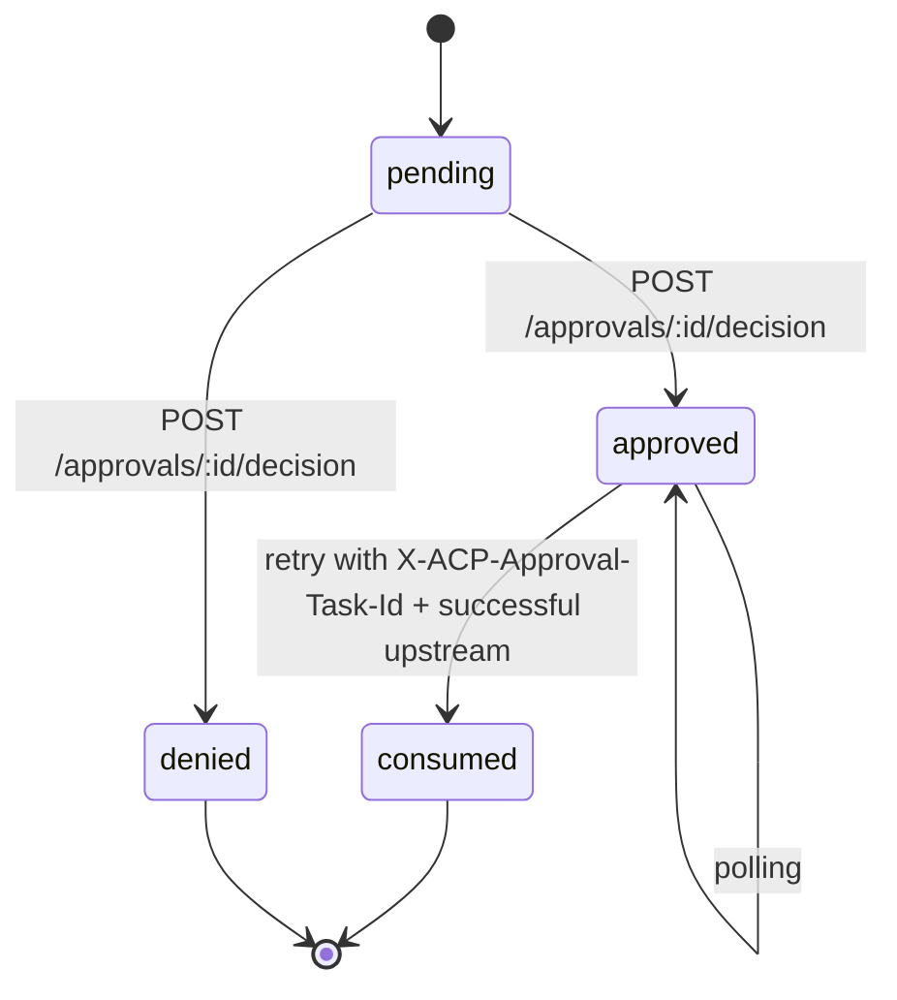
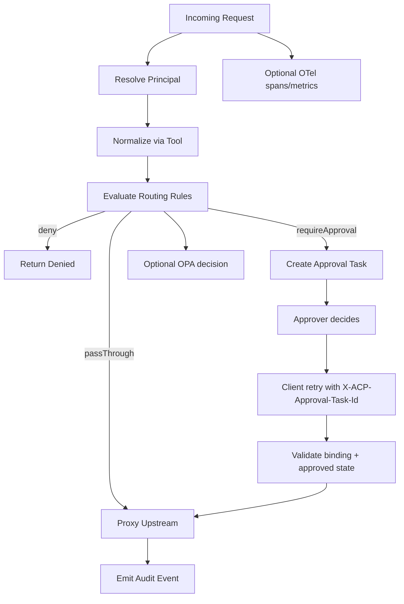

# Concepts

This page gives the mental model you need to reason about ACP quickly.

## Canonical Model

### Principal
Represents who initiated the request.

```ts
type Principal = {
  tenantId?: string;
  env?: string;
  agentId?: string;
  serviceId?: string;
  runId?: string;
  workflowId?: string;
  executionId?: string;
  userId?: string;
  tags?: Record<string, string>;
};
```

### Tool
A Tool detects/normalizes a raw request into consistent governance fields.

```ts
export default defineTool({
  id: "openai",
  match: (ctx) => ctx.host.includes("openai"),
  normalize: (ctx) => ({
    tool: "openai",
    action: "chat.completions",
    resource: ctx.host,
    approvalBind: `openai:${ctx.method}:${ctx.host}:${ctx.path}`,
  }),
});
```

### CanonicalAction
What Gateway uses for routing/policy/audit.

```ts
type CanonicalAction = {
  principal: Principal;
  channel: "http" | "mcp" | "egress";
  request: {
    method: string;
    host: string;
    path: string;
    contentType?: string;
    bodySize?: number;
  };
  target: {
    tool?: string;
    action?: string;
    resource?: string;
    approvalBind?: string;
  };
};
```

## Routing Actions

`Routing Rules` are evaluated top-to-bottom, first match wins.

- `passThrough`: proxy to upstream.
- `deny`: return denied response.
- `requireApproval`: create Approval Task and return `approval_required`.
- `enforcePolicy`: ask OPA, then map decision to allow/deny/approval.

## Approval Lifecycle



## Audit vs OpenTelemetry

Both are useful, but for different jobs:

- `Audit`: decision trail and governance events (`request`, `approval_required`, `approval_decided`, `executed`, `error`).
- `OpenTelemetry`: performance/operations (spans, counters, latency histograms).

Use both in production:
- Audit for accountability.
- OTel for reliability and troubleshooting.

## Minimal Runtime Diagram


