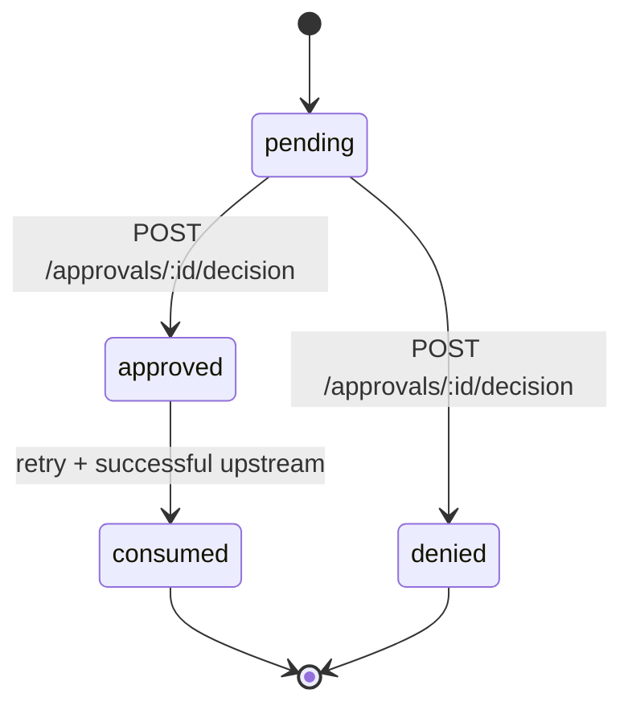

# Concepts

## CanonicalAction

Gateway converts incoming HTTP into a canonical structure used everywhere (routing, approvals, audit, OPA):

```ts
type CanonicalAction = {
  principal: Principal;
  channel: "http" | "mcp" | "egress";
  request: { method: string; host: string; path: string; contentType?: string; bodySize?: number };
  target: { tool?: string; action?: string; resource?: string; approvalBind?: string };
};
```

## Principal

`Principal` identifies caller context (`tenantId`, `env`, `agentId`, `serviceId`, `workflowId`, `runId`, etc.).
Resolved via `principals/*.ts` plugins.

## Tool

A Tool plugin does two jobs:
1. `match(ctx)`
2. `normalize(ctx, body)` -> `tool/action/resource/approvalBind`

## Routing Rules

First match wins.
Actions:
- `passThrough`
- `deny`
- `requireApproval`
- `enforcePolicy` (OPA)

## Approval Task lifecycle



## Channel coverage status

- HTTP: implemented.
- MCP: planned (not implemented yet).
- Egress: planned (not implemented yet).

### Why this matters

`buildRequestContext` in gateway currently sets `channel: "http"`.

### Workaround today

Wrap MCP/Egress calls through HTTP clients and map context into headers (for principal resolution and routing).

### Extension guide (where to implement)

To add MCP/Egress adapters:
1. Add adapter entrypoint before canonicalization.
2. Build a `RequestContext` with `channel: "mcp"` or `"egress"`.
3. Reuse existing normalization/routing/approval pipeline.
