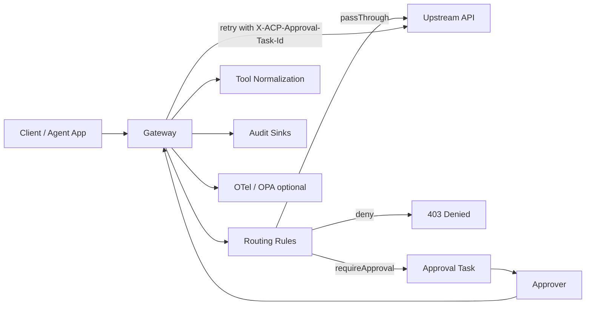

# ACP Documentation

ACP (Agent Governance Gateway) gives you one control point for agent traffic: normalize requests, apply rules/policy, run approval workflows, and emit audit/telemetry.

## Who Should Use ACP

- Teams with agents calling external APIs/tools in prod.
- Teams needing explicit approvals for risky actions.
- Teams needing audit trails without leaking sensitive payloads.

## Outcomes

- Safer production rollout for agent features.
- Clear accountability: who requested what, when, and why it was allowed/denied.
- Lower operational risk with progressive controls.

## Table of Contents

### Fundamentals
- [Why ACP](./why.md)
- [Concepts](./concepts.md)
- [Quickstart](./quickstart.md)

### Build and Configure
- [Configuration](./configuration.md)
- [Plugins](./plugins.md)
- [Approvals](./approvals.md)

### Operate in Production
- [Security](./security.md)
- [Observability](./observability.md)
- [OPA](./opa.md)

### Practical Guides
- [Recipes](./recipes.md)
- [FAQ](./faq.md)

## 3-Minute Mental Model

## Start Here

If this is your first time, go in this order:
1. [Quickstart](./quickstart.md)
2. [Concepts](./concepts.md)
3. [Configuration](./configuration.md)
4. [Plugins](./plugins.md)
5. [Security](./security.md)
