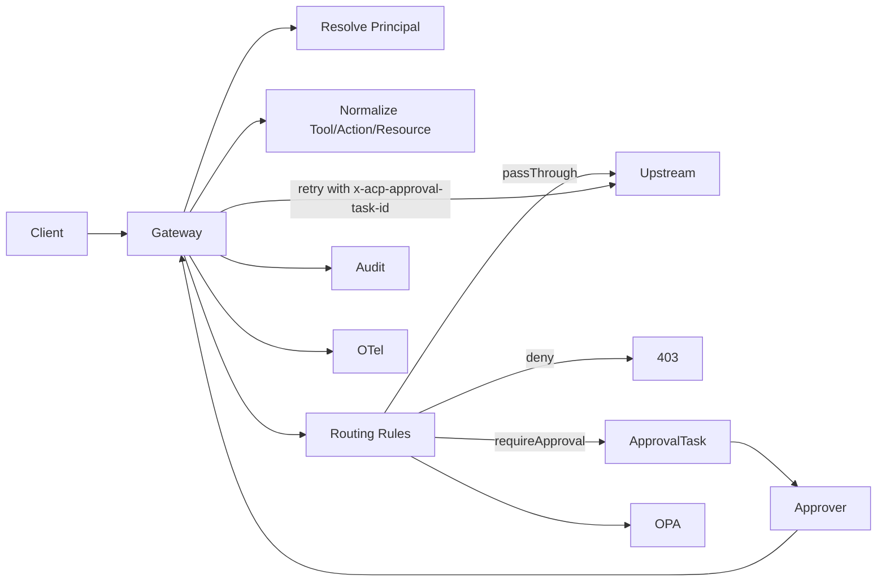

# ACP Docs

ACP (Agent Governance Gateway) gives you one place to control agent HTTP traffic:
- identify caller (`Principal`),
- normalize request (`Tool`),
- apply routing/policy,
- require approval when needed,
- emit audit and telemetry.

## Start here

1. [Quickstart](./quickstart.md)
2. [Concepts](./concepts.md)
3. [Configuration](./configuration.md)

## Table of contents

### Fundamentals
- [Why](./why.md)
- [Concepts](./concepts.md)
- [Quickstart](./quickstart.md)

### Building
- [Configuration](./configuration.md)
- [Principals](./principals.md)
- [Tools](./tools.md)
- [Routing](./routing.md)
- [Proxying](./proxying.md)

### Governance
- [Approvals](./approvals.md)
- [Audit](./audit.md)
- [Observability](./observability.md)
- [OPA](./opa.md)

### Operating
- [Deployment](./deployment.md)
- [Recipes](./recipes.md)
- [Troubleshooting](./troubleshooting.md)
- [FAQ](./faq.md)

## Mental model

> NOTE
> Current runtime channel implementation is HTTP only. MCP/Egress are modeled in types but not implemented in adapters yet.
