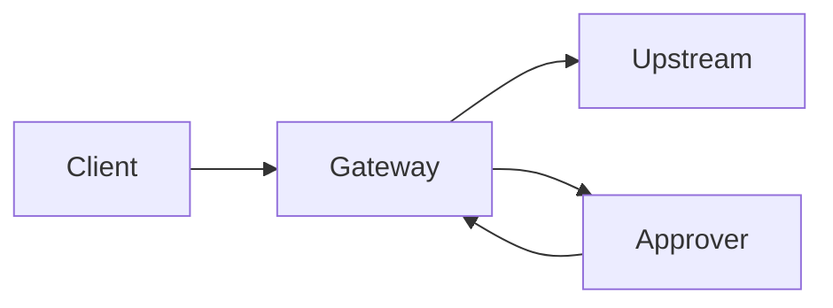

# Quickstart (Beginner-Friendly)

This walkthrough uses the real `apps/example-basic` app and takes under 10 minutes.

## What runs

- Gateway: `http://localhost:3100`
- Upstream mock: `http://localhost:3200`
- Approver mock: `http://localhost:3300`



## 1) Install and run

```bash
pnpm install
cp .env.example .env
pnpm dev:example
```

## 2) Expected console output

You should see lines like:

```text
approval_required: { approval_task_id: "...", poll_url: "/approvals/..." }
retry status: 200 {"ok":true,...}
second retry status: 409 {"error":"already_consumed",...}
```

## 3) What just happened

1. First POST matched `requireApproval` rule (`x-env: prod` in example).
2. Gateway returned `202 approval_required`.
3. Approver mock called decision endpoint and approved task.
4. Client retried with `x-acp-approval-task-id`, upstream executed.
5. Second retry failed (`already_consumed`).

## 4) Manual curl flow (copy/paste)

### A) Request (expect `202 approval_required`)

```bash
curl -i -X POST http://localhost:3100/invoke \
  -H 'content-type: application/json' \
  -H 'x-env: prod' \
  -H 'x-agent-id: agent-demo' \
  -H 'x-tenant-id: tenant-demo' \
  -H 'x-acp-upstream-url: http://localhost:3200/v1/chat/completions' \
  -d '{"prompt":"hello"}'
```

Expected response body:

```json
{
  "status": "approval_required",
  "approval_task_id": "<id>",
  "poll_url": "/approvals/<id>",
  "reason": "route requires approval"
}
```

### B) Poll status

```bash
curl -s http://localhost:3100/approvals/<id>
```

### C) Approve task

```bash
curl -i -X POST http://localhost:3100/approvals/<id>/decision \
  -H 'content-type: application/json' \
  -d '{"status":"approved","decidedBy":"operator-1","reason":"ok"}'
```

### D) Retry with approval task id (expect `200`)

```bash
curl -i -X POST http://localhost:3100/invoke \
  -H 'content-type: application/json' \
  -H 'x-env: prod' \
  -H 'x-agent-id: agent-demo' \
  -H 'x-tenant-id: tenant-demo' \
  -H 'x-acp-upstream-url: http://localhost:3200/v1/chat/completions' \
  -H 'x-acp-approval-task-id: <id>' \
  -H 'x-idempotency-key: req-1' \
  -d '{"prompt":"hello"}'
```

### E) Retry same task again (expect `409 already_consumed`)

```bash
curl -i -X POST http://localhost:3100/invoke \
  -H 'content-type: application/json' \
  -H 'x-env: prod' \
  -H 'x-agent-id: agent-demo' \
  -H 'x-tenant-id: tenant-demo' \
  -H 'x-acp-upstream-url: http://localhost:3200/v1/chat/completions' \
  -H 'x-acp-approval-task-id: <id>' \
  -H 'x-idempotency-key: req-2' \
  -d '{"prompt":"hello"}'
```

## 5) Additional expected errors

### Denied rule (`403`)

```bash
curl -i -X DELETE http://localhost:3100/invoke \
  -H 'x-acp-upstream-url: http://localhost:3200/delete'
```

Expected error:

```json
{ "error": "denied", "reason": "delete_is_forbidden" }
```

### Binding mismatch (`409`)

Use same approved task id but change path/method/host/principal.

Expected error:

```json
{ "error": "binding_mismatch", "message": "approval binding mismatch" }
```

## 6) TypeScript client example

```ts
const first = await fetch("http://localhost:3100/invoke", {
  method: "POST",
  headers: {
    "content-type": "application/json",
    "x-env": "prod",
    "x-agent-id": "agent-demo",
    "x-tenant-id": "tenant-demo",
    "x-acp-upstream-url": "http://localhost:3200/v1/chat/completions",
  },
  body: JSON.stringify({ prompt: "hello" }),
});

const approval = await first.json();

const retry = await fetch("http://localhost:3100/invoke", {
  method: "POST",
  headers: {
    "content-type": "application/json",
    "x-env": "prod",
    "x-agent-id": "agent-demo",
    "x-tenant-id": "tenant-demo",
    "x-acp-upstream-url": "http://localhost:3200/v1/chat/completions",
    "x-acp-approval-task-id": approval.approval_task_id,
    "x-idempotency-key": "req-100",
  },
  body: JSON.stringify({ prompt: "hello" }),
});
```

## Troubleshooting

### `missing_upstream`
You must send `x-acp-upstream-url`.

### Task stays `pending`
Check approver connectivity and decision endpoint calls.

### DB errors
If `APPROVALS_DB_URL` is unset, example uses in-memory approval store.
