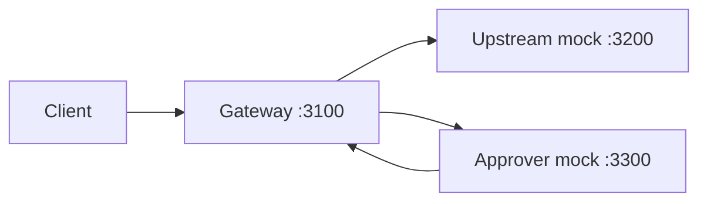

# Quickstart

This is the fastest way to see ACP’s approval workflow end-to-end.

## What You Will Run

The example app starts three services:
- Gateway (`:3100`)
- Upstream mock (`:3200`)
- Approver mock (`:3300`)



## 1) Install and Start

```bash
pnpm install
cp .env.example .env
pnpm dev:example
```

## 2) Observe the Expected Flow

You should see logs similar to:

```text
approval_required: { approval_task_id: "...", poll_url: "/approvals/..." }
retry status: 200 {"ok":true,...}
second retry status: 409 {"error":"already_consumed",...}
```

This confirms:
1. Initial request required approval.
2. Approver approved task.
3. First retry with `X-ACP-Approval-Task-Id` executed.
4. Second retry was blocked (one-time consume).

## 3) Headers Used by ACP

- `X-ACP-Upstream-Url`: required in MVP proxy mode.
- `X-ACP-Approval-Task-Id`: required when retrying an approved task.
- `X-Idempotency-Key`: recommended on retries.

## 4) Manual API Walkthrough (Reference)

If you run a Gateway process you can use these calls directly.

### Step A: Request (approval expected)

```bash
curl -i -X POST http://localhost:3100/invoke \
  -H 'content-type: application/json' \
  -H 'x-env: prod' \
  -H 'x-agent-id: agent-demo' \
  -H 'x-tenant-id: tenant-demo' \
  -H 'X-ACP-Upstream-Url: http://localhost:3200/v1/chat/completions' \
  -d '{"prompt":"hello"}'
```

Expected response includes:

```json
{
  "status": "approval_required",
  "approval_task_id": "...",
  "poll_url": "/approvals/..."
}
```

### Step B: Poll task status

```bash
curl -s http://localhost:3100/approvals/<APPROVAL_TASK_ID>
```

### Step C: Approve task (decision endpoint)

```bash
curl -i -X POST http://localhost:3100/approvals/<APPROVAL_TASK_ID>/decision \
  -H 'content-type: application/json' \
  -d '{"status":"approved","decidedBy":"operator-1","reason":"approved"}'
```

### Step D: Retry with approval task id

```bash
curl -i -X POST http://localhost:3100/invoke \
  -H 'content-type: application/json' \
  -H 'x-env: prod' \
  -H 'x-agent-id: agent-demo' \
  -H 'x-tenant-id: tenant-demo' \
  -H 'X-ACP-Upstream-Url: http://localhost:3200/v1/chat/completions' \
  -H 'X-ACP-Approval-Task-Id: <APPROVAL_TASK_ID>' \
  -H 'X-Idempotency-Key: req-001' \
  -d '{"prompt":"hello"}'
```

### Step E: Retry again (should fail)

```bash
curl -i -X POST http://localhost:3100/invoke \
  -H 'content-type: application/json' \
  -H 'x-env: prod' \
  -H 'x-agent-id: agent-demo' \
  -H 'x-tenant-id: tenant-demo' \
  -H 'X-ACP-Upstream-Url: http://localhost:3200/v1/chat/completions' \
  -H 'X-ACP-Approval-Task-Id: <APPROVAL_TASK_ID>' \
  -H 'X-Idempotency-Key: req-002' \
  -d '{"prompt":"hello"}'
```

Expected: `409` + `already_consumed`.

## Troubleshooting

### `pnpm: command not found`
Install pnpm and retry.

### DB connection errors
If `APPROVALS_DB_URL` is unset, example uses in-memory approvals store.

### Approval never becomes approved
Check `APPROVER_WEBHOOK_URL` in `.env` and ensure approver mock is running.

### `missing_upstream`
Always send `X-ACP-Upstream-Url` in MVP proxy mode.
